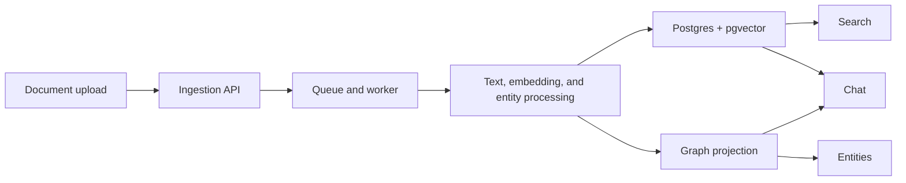

# Ragdoll

#### Tech Stack

- 🚀 Backend: Python (FastAPI), Redis, PostgreSQL
- 💻 Frontend: TypeScript, Vite + React
- 🛠️ Infrastructure: Docker, DBmate

Ragdoll is a self-hosted knowledge workspace. It ingests documents, builds searchable and graph-backed context, keeps evidence and corrections attached to answers, and exposes that state through search, chat, entities, pinned facts, changes, and admin surfaces.

License: [Business Source License 1.1](LICENSE)  
Free for personal use and internal organizational use; see [License Summary](LICENSE-SUMMARY.md)  
Apache License 2.0 on 2030-01-01

## Architecture Visual



This is the fast, high-level story: documents move through ingestion and background processing into retrieval and graph projections that power the product experience. For the canonical detailed flow, start with [docs/architecture/ingestion-and-processing.md](docs/architecture/ingestion-and-processing.md) and then use the broader [architecture guide](docs/architecture/README.md).

## Product Overview

The current application includes:

- a FastAPI backend in `apps/api`
- a Vite + React frontend in `apps/web`
- shared OpenAPI and TypeScript contracts in `packages/contracts`
- DBmate-managed relational schema under `apps/api/db`
- Redis-backed background processing for document ingestion
- self-hosted runtime dependencies wired through `infra/docker`

Primary capability areas:

- auth, users, and spaces
- document library, upload, processing, and download
- search, entities, and knowledge graph exploration
- chat with citations and correction submission
- pinned facts and change tracking
- admin runtime visibility and usage reporting

## Repository Structure

```text
ragdoll-redux/
  apps/
    api/
    web/
  packages/
    contracts/
    config/
    tooling/
  tests/
    e2e/
  infra/
    docker/
    supabase/
    ollama/
  scripts/
    dev/
    test/
    ops/
  docs/
```

Read [INDEX.md](INDEX.md) before broad codebase traversal. It is the placement guide for pages, modules, tests, contracts, and scripts.

## Documentation Guide

Start with the current-state docs:

- Architecture: [docs/architecture/README.md](docs/architecture/README.md)
- Executive overview: [docs/executive/system-brief.md](docs/executive/system-brief.md)
- Operating model and risk: [docs/executive/operating-model-and-risk.md](docs/executive/operating-model-and-risk.md)
- Engineering subsystem docs:
  - [docs/engineering/identity-and-access.md](docs/engineering/identity-and-access.md)
  - [docs/engineering/documents-and-ingestion.md](docs/engineering/documents-and-ingestion.md)
  - [docs/engineering/retrieval-and-knowledge.md](docs/engineering/retrieval-and-knowledge.md)
  - [docs/engineering/interaction-and-governance.md](docs/engineering/interaction-and-governance.md)
  - [docs/engineering/api-surface-and-module-ownership.md](docs/engineering/api-surface-and-module-ownership.md)

## Local Development

Use `./dev-setup.sh` as the main entrypoint.

- Start infra: `./dev-setup.sh infra up`
- Start the application stack: `./dev-setup.sh daemon`
- Inspect services: `./dev-setup.sh ps`
- Run the full repo test suite: `./dev-setup.sh test`
- Run end-to-end coverage: `./dev-setup.sh test-e2e`
- Stop the app stack: `./dev-setup.sh down`
- Stop infra: `./dev-setup.sh infra down`

Startup helpers create these files when missing:

- `apps/api/.env` from `apps/api/.env.example`
- `apps/web/.env` from `apps/web/.env.example`
- `infra/docker/.env.infra` from `infra/docker/.env.infra.example`

Testing expectations live in [TESTING.md](TESTING.md).

## Runtime Shape

The logged-out surface stays intentionally small:

- `/` and `/login`
- `/register`
- `/status`

Authenticated users move through `dashboard`, `spaces`, `documents`, `search`, `chat`, `entities`, `pinned-facts`, `changes`, and `account`. Admin users also get `/admin`.

## Docs Maintenance

Canonical current-state docs live in:

- `docs/architecture/` for system architecture
- `docs/executive/` for high-level leadership-facing docs
- `docs/engineering/` for codebase-facing subsystem docs

Use Mermaid diagrams in those areas whenever a flow, dependency, or ownership boundary is easier to understand visually than in prose.
