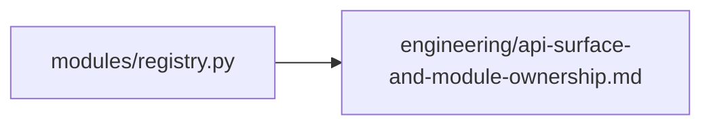

# API v1 Module Inventory

The current `/api/v1` inventory now lives in [engineering/api-surface-and-module-ownership.md](./engineering/api-surface-and-module-ownership.md).

Use that document as the canonical source for:

- live module prefixes
- frontend ownership
- contract ownership
- primary test coverage
