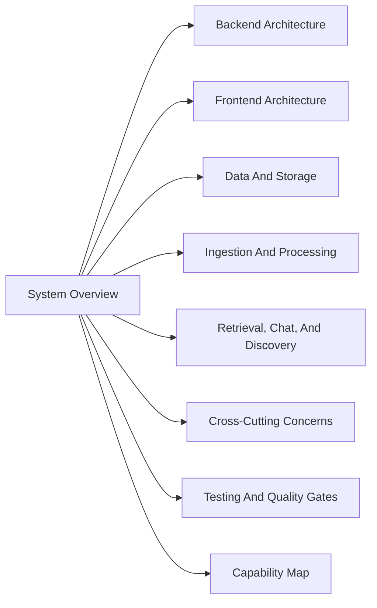

# Ragdoll Architecture

This directory is the canonical current-state architecture guide for Ragdoll. It documents the live runtime shape, ownership boundaries, and feature flows across the backend, frontend, workers, storage, and tests.

The root [README.md](../../README.md) carries a simplified architecture visual for quick orientation. Treat [ingestion-and-processing.md](./ingestion-and-processing.md) as the canonical detailed version of that document pipeline flow.

## Reading Order

1. [system-overview.md](./system-overview.md)
2. [backend-architecture.md](./backend-architecture.md)
3. [frontend-architecture.md](./frontend-architecture.md)
4. [data-and-storage.md](./data-and-storage.md)
5. [ingestion-and-processing.md](./ingestion-and-processing.md)
6. [retrieval-chat-and-discovery.md](./retrieval-chat-and-discovery.md)
7. [cross-cutting-concerns.md](./cross-cutting-concerns.md)
8. [testing-and-quality-gates.md](./testing-and-quality-gates.md)
9. [capability-map.md](./capability-map.md)

## Documentation Model

- `docs/architecture/` explains the system as a whole
- `docs/executive/` explains the system for internal leadership
- `docs/engineering/` explains subsystem behavior and code ownership for implementers
- app READMEs explain how to work in an area, not the whole product architecture

## Architecture Rules

- Keep `apps/api` and `apps/web` as the only application roots
- Treat the backend as a modular monolith with explicit module ownership
- Treat workers as first-class runtime entrypoints, not hidden implementation details
- Keep frontend feature ownership aligned with the route tree
- Keep shared contracts in `packages/contracts`
- Prefer current-state docs over historical planning notes

## Maintenance Rules

- Update architecture docs when implementation changes a public route, ownership boundary, or cross-system flow
- Add Mermaid diagrams when a dependency, flow, or ownership map is easier to absorb visually
- Keep historical planning notes out of canonical current-state areas
