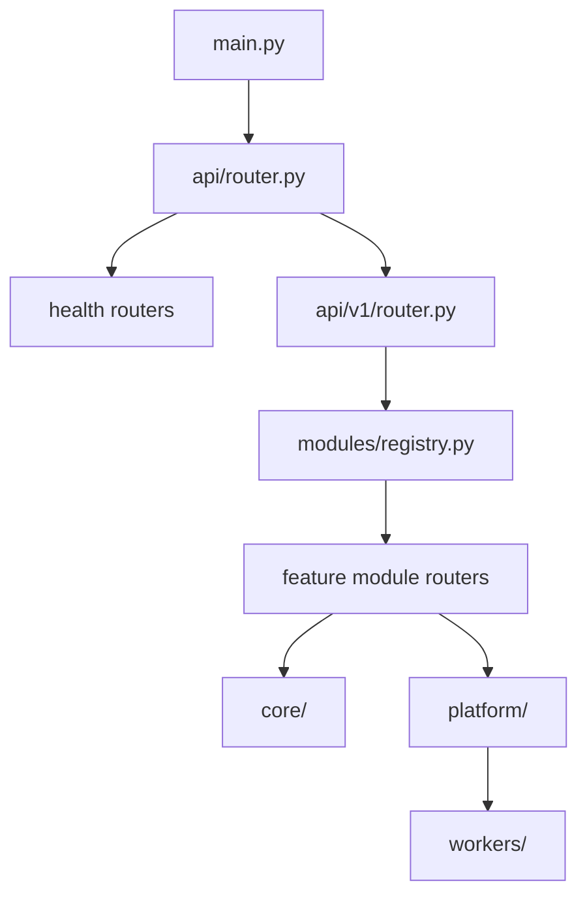

# Backend Architecture

## Purpose

Describe the live `apps/api` layout, router composition, module ownership, and worker/runtime boundaries.

## Current Shape

```text
apps/api/
  src/ragdoll/
    main.py
    api/
    core/
    modules/
    platform/
    workers/
  db/
  tests/
```

## Layer Ownership

- `api/` owns route composition, health endpoints, dependencies, and HTTP error translation
- `core/` owns config, auth/security primitives, logging, pagination, and instance policy
- `modules/` own feature behavior and request/response schemas
- `platform/` owns database, storage, graph, vector, LLM, and queue adapters
- `workers/` own long-running background entrypoints



## Live Module Surface

The `/api/v1` router is built from `V1_MODULE_REGISTRY` and currently mounts:

- `auth`
- `users`
- `spaces`
- `documents`
- `ingestion`
- `search`
- `chat`
- `entities`
- `knowledge_graph`
- `pinned_facts`
- `changes`
- `corrections`
- `admin`
- `usage`

Typical module structure is:

```text
modules/<module>/
  api/
  application/
  domain/        # when needed
  infrastructure/
```

Not every module uses every subdirectory, but the ownership split stays consistent: transport in `api/`, orchestration in `application/`, persistence adapters in `infrastructure/`, and policy/value modeling in `domain/` when the module needs it.

## Runtime Flows

1. `main.py` configures logging, CORS, exception handlers, and router composition.
2. `api/router.py` mounts liveness, status, and `/api/v1`.
3. `api/v1/router.py` mounts readiness plus every module router from the registry.
4. Modules call shared core and platform services rather than reaching across each other ad hoc.
5. Workers in `workers/document_pipeline.py` and `workers/pinned_facts_recompute.py` handle background work that should not run in request lifecycles.

## Boundaries And Invariants

- `/api/v1` is the canonical API namespace
- readiness checks report database, storage, vector, graph, LLM, and queue status
- Redis-backed queues are part of the supported backend runtime
- product logic belongs in modules, not in `api/` or `platform/`
- admin behavior must pass through shared auth and policy layers
