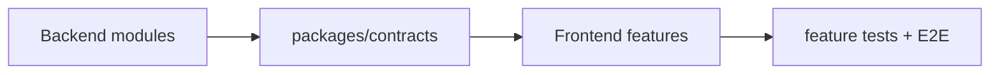

# Capability Map

## Purpose

Map live capabilities to backend modules, frontend owners, contract areas, and primary tests.

| Capability | Backend owner | Frontend owner | Contract area | Primary tests |
| --- | --- | --- | --- | --- |
| Authentication and session bootstrap | `modules/auth` | `features/auth` | `schemas/auth` | backend auth + auth page tests |
| Authenticated landing and session-aware shell boot | shared auth/session bootstrap + routed feature composition | `features/dashboard` | auth and shared session contracts | app router/guard tests + dashboard page tests |
| User profile and account usage | `modules/auth`, `modules/users`, `modules/usage` | `features/account` | `schemas/auth`, `schemas/users`, `schemas/usage` | backend module tests + account page tests |
| Spaces and scope | `modules/spaces` | `features/spaces` | `schemas/spaces` | backend spaces + spaces page tests |
| Document library and detail | `modules/documents` | `features/documents` | `schemas/documents` | backend documents + documents page tests |
| Upload and processing | `modules/ingestion` | `features/documents` | `schemas/ingestion` | backend ingestion + E2E |
| Search | `modules/search` | `features/search` | `schemas/search` | backend search + search page tests |
| Chat and correction submission | `modules/chat`, `modules/corrections` | `features/chat` | `schemas/chat`, `schemas/corrections` | backend chat/corrections + chat tests + E2E |
| Entities and graph reads | `modules/entities`, `modules/knowledge_graph` | `features/entities` | `schemas/entities`, `schemas/knowledge_graph` | backend module tests + entities page tests |
| Pinned facts | `modules/pinned_facts` | `features/pinned-facts` | `schemas/pinned_facts` | backend pinned facts + pinned-facts page tests |
| Changes feed | `modules/changes` | `features/changes` | `schemas/changes` | backend changes + changes page tests |
| Admin runtime and user management | `modules/admin` | `features/admin` | `schemas/admin` | backend admin + admin page tests |
| Runtime status | shared API health + admin/runtime support | `features/marketing` and `features/admin` | shared schemas + admin contracts | backend health + shell/E2E |

## Notes

- correction behavior is frontend-owned by `features/chat`, not a standalone routed corrections feature
- all shared contracts are ultimately consumed through `packages/contracts`
- update this map whenever a new routed feature or backend module is added
