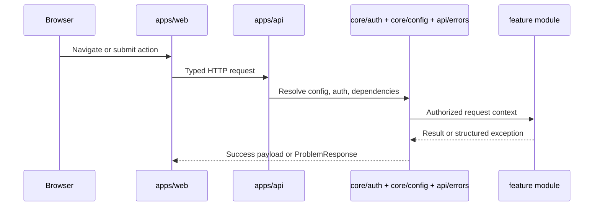

# Cross-Cutting Concerns

## Purpose

Capture shared policies that apply across modules, pages, and workers.

## Shared Homes

- backend: `core/`, `api/dependencies.py`, `api/errors.py`
- frontend: `app/providers.tsx`, `shared/api/client.ts`, `shared/state/`

## Cross-System Rules

- backend authorization is authoritative; frontend guards are user experience only
- environment parsing and effective instance limits are centralized
- errors are normalized into stable HTTP problem responses
- request logging and dependency health are part of the live runtime surface
- secrets stay in environment or secret stores, never committed files

## Operational Concerns

- readiness reports database, storage, vector, graph, LLM, and queue dependency state
- Redis queue availability is part of production readiness
- self-hosted instance policy affects ingestion, admin, and usage behavior through shared backend logic

## Primary Workflows

1. Config loads and validates runtime settings.
2. Session bootstrap returns user identity and admin status.
3. Requests pass through shared auth and Space-scope dependencies before module handlers.
4. Errors are translated into stable problem shapes.
5. Frontend transport maps those shapes into feature-friendly behavior.
6. Health, status, and admin effective-limits views expose operational state for development and deployment checks.

## Failure Modes and Edge Cases

- Missing env vars can leave the app half-configured unless startup validation is strict.
- Config drift between documented limits and enforced runtime policy can create broken flows.
- Admin test tools can become unsafe if they bypass shared policy or secret handling layers.
- LLM, vector, or graph outages must degrade predictably and visibly.
- Hard redirects on auth expiration must not lose unsaved user context where recoverable.

## Acceptance Checks

- Shared config, auth, instance policy, and error translation have explicit homes.
- No feature implements its own incompatible auth or limit-resolution path.
- Health/readiness semantics include all major dependencies.
- Secrets and tokens are never treated as frontend-managed values.
- Rate limits are documented for high-cost operations.

## Deferred Notes

- More advanced tracing can be added later, but log and health semantics should remain stable.
