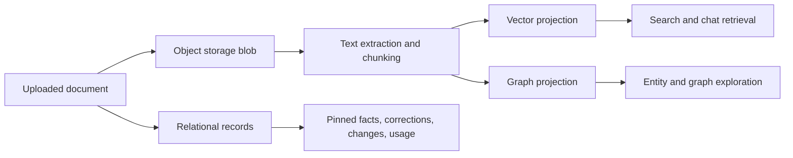

# Data And Storage

## Purpose

Describe where authoritative state lives, what is derived, and how provenance moves across the system.

## Storage Roles

- relational database: authoritative app records, scope, statuses, history, and governance state
- object storage: original uploaded files and downloadable artifacts
- vector-backed relational projection: retrieval-oriented chunk embeddings and search payloads
- graph-backed relational projection: relationship-oriented entity and document connections

## Authoritative State

The relational layer is authoritative for:

- users and admin-managed user state
- spaces and scope boundaries
- document records and processing status
- chat sessions and persisted messages
- pinned facts, candidates, and history
- changes and corrections
- usage summaries and instance-policy inputs

## Derived State

Derived stores are important but reproducible:

- vector rows are generated from extracted chunk content
- graph relationships are projections from documents and extraction results
- runtime answers are generated from evidence and should not become a hidden source of truth

## Provenance Rules

- object storage keeps the source files
- relational rows keep stable identifiers and lifecycle state
- search, chat, entities, and pinned facts must point back to evidence-bearing records
- verified human corrections can influence current-state outputs while preserving earlier evidence and history

## Invariants

- scope boundaries start in relational state and carry into every derived read surface
- partial processing must be visible through status rather than hidden behind retries
- vector and graph records should be safe to regenerate from authoritative state
