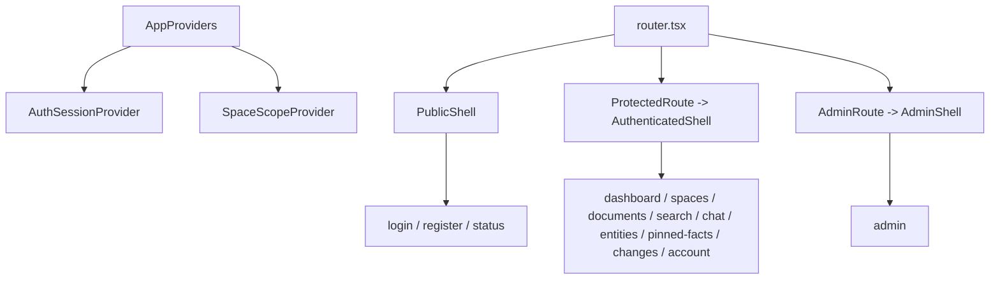

# Frontend Architecture

## Purpose

Describe the live `apps/web` route model, provider stack, feature ownership, and shared browser boundaries.

## Current Shape

```text
apps/web/src/
  app/
  features/
  shared/
```

The app tree owns route wiring, providers, shells, and guards. Feature folders own pages, feature-local API wrappers, and tests. Shared folders own cross-feature transport, formatting helpers, and state providers.



## Live Route Ownership

- `auth`: `/`, `/login`, `/register`
- `marketing`: `/status`
- `dashboard`: `/dashboard`
- `spaces`: `/spaces`
- `documents`: `/documents`, `/documents/:documentId`
- `search`: `/search`
- `chat`: `/chat`, `/chat/:sessionId`
- `entities`: `/entities`, `/entities/:entityId`
- `pinned-facts`: `/pinned-facts`, `/pinned-facts/create`, `/pinned-facts/:factId`
- `changes`: `/changes`
- `account`: `/account`
- `admin`: `/admin`

There is no standalone routed `corrections` feature today. Correction submission is part of the chat experience.

## Shared Browser Boundaries

- `app/providers.tsx` creates the query client and mounts auth/session plus space scope providers
- `shared/api/client.ts` is the shared transport entrypoint
- `shared/api/runtimeStatus.ts` supports runtime status flows
- `shared/state/authSession.tsx` and `shared/state/spaceScope.tsx` hold app-wide session and scope state

## Frontend Invariants

- route guards are advisory UX; backend authorization stays authoritative
- shared request/response types come from `packages/contracts/typescript`
- public pages stay limited to login, registration, and status
- feature logic should stay with the owning feature rather than drift into generic shared folders
