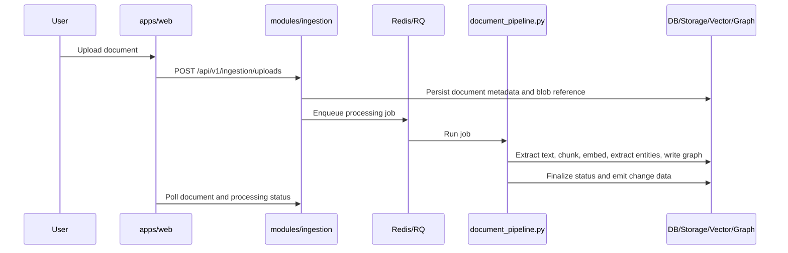

# Ingestion And Processing

## Purpose

Describe how documents move from upload into searchable, explorable, and governable knowledge.

## Owning Areas

- `modules/ingestion` owns upload, processing, retry, and status endpoints
- `modules/documents` owns document reads, download, delete, and metadata views
- `workers/document_pipeline.py` owns the long-running stage pipeline
- `platform/storage`, `platform/vector`, `platform/graph`, `platform/llm`, and `platform/queues` own external-system adapters

## Processing Flow

## Stages

1. intake and validation
2. metadata and blob persistence
3. text extraction
4. chunking
5. embedding generation and vector writes
6. entity extraction
7. graph projection
8. status finalization and downstream visibility

## Invariants

- SQL-backed records remain the durable lifecycle ledger
- Redis-backed queues are the live dispatch mechanism
- a document can be readable while later stages are still incomplete
- retries must be safe for vector, entity, and graph regeneration
- scope is assigned before background work fans out

## Important Failure Modes

- extraction can succeed while vector or graph stages fail
- worker restarts must not create duplicate downstream projections
- targeted retries should avoid unnecessary full reparses when only later stages failed

## Deferred Notes

- Advanced OCR or multi-pass chunk extraction can extend the parsing stage without changing the owning module boundaries.
- Future document-version-line grouping should layer on top of document and ingestion commands instead of forking the pipeline.
