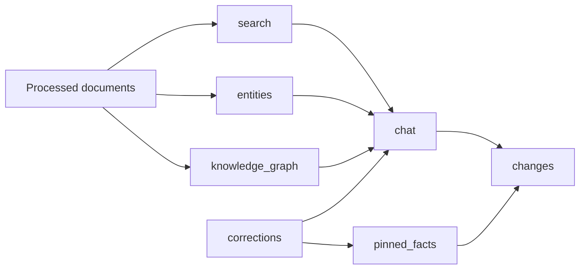

# Retrieval, Chat, And Discovery

## Purpose

Describe how search, entities, graph exploration, chat, corrections, and pinned facts build on the same evidence layer.

## Owning Modules

- `search`
- `entities`
- `knowledge_graph`
- `chat`
- `pinned_facts`
- `changes`
- `corrections`

## Retrieval Model

- search resolves scope-aware list results
- entities expose entity-centered views of extracted knowledge
- knowledge graph exposes relationship-oriented reads
- chat orchestrates evidence from search, graph, corrections, and prior session context
- pinned facts summarize current-state answers from evidence and history
- changes surface notable state transitions to users

## Key Rules

- retrieval is scope-aware before it is ranking-aware
- chat is a consumer of retrieval outputs, not its own hidden source of truth
- citations are required for user-facing answer trust
- verified corrections can influence current-state summaries and answer composition
- history remains visible even when a newer correction or pinned-fact value becomes current

## Important Failure Modes

- search and graph evidence may disagree in strength or coverage
- chat can degrade when retrieval is partial, but citations must still remain meaningful
- current-state summaries can conflict with older history or pending corrections
- all-spaces reads must never leak into single-space write workflows
