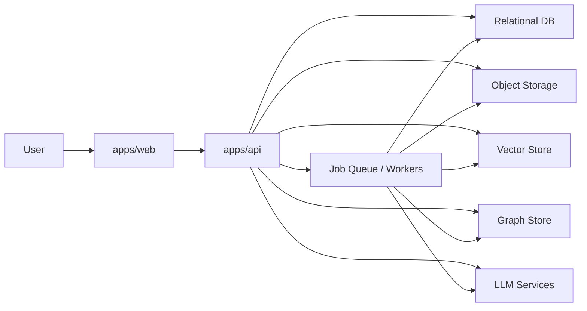

# System Overview

## Purpose

Define the product boundaries, deployment model, canonical repository structure, and top-level flow for Ragdoll.

## Product Summary

Ragdoll is a knowledge system for architecture and product understanding. It ingests documents, extracts structured knowledge, maintains searchable context, tracks current state, and answers questions through search and chat surfaces with citations.

## Target Design

Ragdoll is implemented as a modular monolith with two app roots and three support layers:

```text
ragdoll/
  apps/
    api/
    web/
  packages/
    contracts/
    config/
    tooling/
  tests/
    e2e/
  infra/
    docker/
    supabase/
    ollama/
  scripts/
  docs/
```

### Product Capabilities

Ragdoll includes these capability areas:

- Authentication and user profile management
- Spaces and active/all-spaces scope
- Document upload, indexing, preview, deletion, and reprocessing
- Dropbox integration and sync
- Entity and decision extraction
- Knowledge graph storage and exploration
- Unified search and hybrid retrieval
- Chat sessions with citations and corrections
- Tracked state and conflict resolution
- Change feed and read state
- Admin tooling, usage, plan tiers, and feature flags
- Marketing pages and authenticated product shell
- Automated testing across backend, frontend, and E2E flows

### Deployment Model

- `apps/api` is the single backend deployable for HTTP APIs and shared runtime wiring.
- `apps/web` is the single browser-facing web application.
- Background workers are separate runtime entrypoints owned by `apps/api`, not separate products.
- Relational storage, object storage, vector indexing, graph storage, and LLM workflows remain external dependencies behind adapters.



## Responsibilities and Boundaries

- `apps/api`: HTTP routing, shared runtime wiring, module composition, worker entrypoints, platform adapters.
- `apps/web`: route shells, feature UIs, session handling, contract-driven API access.
- `packages/contracts`: shared schema and generated client types.
- `packages/config`: reusable env templates, lint/test config, and conventions.
- `packages/tooling`: codegen and structural verification helpers.
- `tests/e2e`: product-level cross-surface verification only.
- `infra`: local runtime definitions and operations notes, not product logic.
- `scripts`: thin developer and CI entrypoints.

## Public Interfaces and Shared Types

Ragdoll locks in these public seams:

- Canonical backend namespace: `/api/v1`
- Optional compatibility alias: `/api` during migration only
- Shared contracts for auth, spaces, documents, search, chat, entities, tracked state, changes, admin, usage, and future extensions
- Cross-cutting shared types: `SpaceScope`, `Citation`, `ProcessingStatus`, `PlanTier`, `FeatureFlags`, `PaginatedResponse`, `ProblemResponse`, `MutationResult`

## Primary Workflows

1. User signs in through `apps/web`, receives session state, selected Space, and resolved feature flags from `apps/api`.
2. User uploads or syncs documents into a Space.
3. Background workers parse content, store originals, chunk text, create embeddings, extract entities, and populate graph structures.
4. Search and chat query vector, graph, and relational projections through application services.
5. Users review current state, history, citations, tracked fields, and corrections from scoped product surfaces.
6. Admins manage users, plans, flags, and runtime readiness without bypassing shared policy layers.

## Failure Modes and Edge Cases

- Partial processing: one document may have stored content but incomplete vector or graph outputs.
- Current-state ambiguity: multiple evidence sources may disagree and require visible conflict handling.
- Compatibility drift: if `/api` aliases survive too long, frontend and docs can diverge from `/api/v1`.
- Scope leakage: all-spaces views must remain explicit and auditable.
- Background retries: repeated failures must not duplicate graph or embedding records.

## Acceptance Checks

- Every later architecture doc uses the repo tree in this file.
- All capability areas appear in downstream module or feature specs.
- All runtime dependencies are described as explicit adapters or infrastructure, not hidden utility code.
- The canonical API prefix is `/api/v1`.

## Deferred Notes

- Service extraction is out of scope unless scale or isolation needs become concrete.
- Multi-tenant SaaS architecture is intentionally deferred; current design remains user-owned workspaces within one product.
