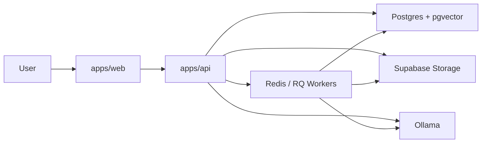

# System Overview

## Purpose

Describe the live product boundary, runtime shape, and top-level flows for Ragdoll.

## Product Summary

Ragdoll is a self-hosted knowledge workspace for teams that need document-backed search, chat, provenance, and current-state tracking. The system turns uploaded source material into searchable chunks, extracted entities, graph relationships, pinned facts, and evidence-backed answers.

## Repository Shape

```text
ragdoll-redux/
  apps/
    api/
    web/
  packages/
    contracts/
    config/
    tooling/
  tests/
    e2e/
  infra/
    docker/
    supabase/
    ollama/
  scripts/
  docs/
```

## Runtime Model

- `apps/api` serves `/health`, `/api/v1/health`, and the `/api/v1` module surface
- `apps/web` serves the public, authenticated, and admin browser flows
- background workers owned by `apps/api` process uploaded documents and recompute pinned facts
- shared contracts flow from backend-owned schemas into generated frontend types



## Capability Areas

- auth, user profile, and space scoping
- document library and upload processing
- search, entities, and knowledge graph exploration
- chat with citations and corrections
- pinned facts and change tracking
- admin, usage, and runtime visibility

## Primary Flows

1. A user signs in, loads session state, and selects a `SpaceScope`.
2. The user uploads or revisits documents in that space.
3. Background workers persist blobs, extract text, generate embeddings, write retrieval projections, and record entity and graph data.
4. Search, entities, graph exploration, and chat read from the resulting projections with space-aware boundaries.
5. Corrections, pinned facts, and changes capture human feedback and current-state governance on top of the evidence layer.

## Boundaries

- `apps/api` owns backend modules, routing, workers, runtime policy, and dependency probes
- `apps/web` owns route shells, page composition, guards, shared browser state, and typed API consumption
- `packages/contracts` owns cross-app wire contracts
- `tests/e2e` owns stitched, user-visible flows rather than module internals

## Key Constraints

- `/api/v1` is the canonical HTTP namespace
- workers are part of the documented runtime, not an implementation footnote
- all-spaces reads must remain explicit
- user-facing answers and current-state summaries depend on provenance and citations
