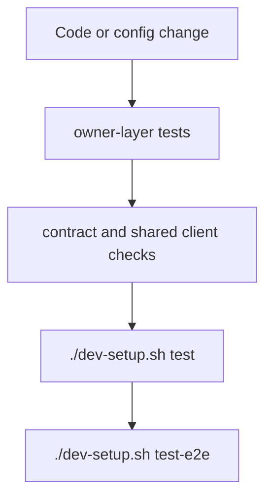

# Testing And Quality Gates

## Purpose

Describe where validation lives and which commands gate non-doc changes.

## Test Layout

- backend module and platform tests: `apps/api/tests/`
- app wiring tests: `apps/web/src/app/tests/`
- feature tests: `apps/web/src/features/*/tests/`
- shared frontend transport tests: `apps/web/src/shared/api/tests/`
- product-level E2E: `tests/e2e/`

## Quality Gates

- backend and Python validation should run through the Docker-backed repo wrappers
- after non-doc code or config changes, run `./dev-setup.sh test`
- after non-doc code or config changes, run `./dev-setup.sh test-e2e`
- contract updates should remain aligned with generated frontend consumption

## Coverage Expectations

- backend modules cover their own route and behavior surface
- frontend features cover their page-level flows and guards
- E2E covers stitched user journeys like auth, shell loading, pinned facts, and changes
