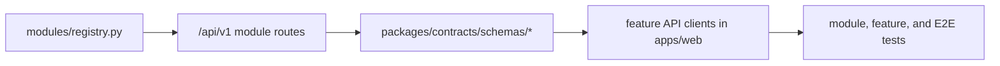

# API Surface And Module Ownership

## Scope

This document is the live inventory of the `/api/v1` surface and its main frontend and contract consumers.

## Module Map

| Module | Prefix | Frontend owner | Contract area | Primary tests |
| --- | --- | --- | --- | --- |
| `auth` | `/api/v1/auth` | `features/auth`, `features/account` | `schemas/auth` | backend auth + auth/account tests |
| `users` | `/api/v1/users` | `features/account`, `features/admin` | `schemas/users` | backend user-facing coverage through auth/admin/account flows |
| `spaces` | `/api/v1/spaces` | `features/spaces` | `schemas/spaces` | backend spaces + spaces page tests |
| `documents` | `/api/v1/documents` | `features/documents` | `schemas/documents` | backend documents + documents page tests |
| `ingestion` | `/api/v1/ingestion` | `features/documents` | `schemas/ingestion` | backend ingestion + E2E |
| `search` | `/api/v1/search` | `features/search` | `schemas/search` | backend search + search page tests |
| `chat` | `/api/v1/chat` | `features/chat` | `schemas/chat` | backend chat + chat tests + E2E |
| `entities` | `/api/v1/entities` | `features/entities` | `schemas/entities` | backend entities + entities page tests |
| `knowledge_graph` | `/api/v1/knowledge-graph` | `features/entities` | `schemas/knowledge_graph` | backend knowledge graph + entities page tests |
| `pinned_facts` | `/api/v1/pinned-facts` | `features/pinned-facts` | `schemas/pinned_facts` | backend pinned facts + pinned-facts page tests |
| `changes` | `/api/v1/changes` | `features/changes` | `schemas/changes` | backend changes + changes page tests |
| `corrections` | `/api/v1/corrections` | `features/chat` | `schemas/corrections` | backend corrections + chat/E2E |
| `admin` | `/api/v1/admin` | `features/admin` | `schemas/admin` | backend admin + admin page tests |
| `usage` | `/api/v1/usage` | `features/account`, `features/admin` | `schemas/usage` | backend usage + account/admin tests |

## Notes

- the canonical route inventory comes from `apps/api/src/ragdoll/modules/registry.py`
- feature API wrappers live under `apps/web/src/features/*/api/`
- correction behavior is surfaced through chat rather than a standalone routed corrections page
