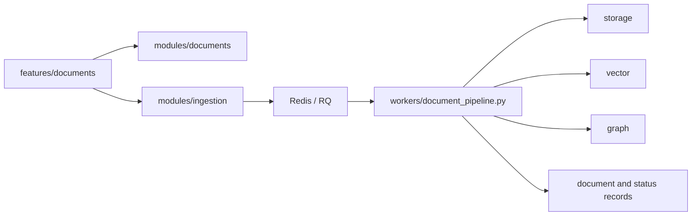

# Documents And Ingestion

## Scope

This subsystem covers the document library, uploads, processing status, downloads, retries, and the worker pipeline that turns source files into retrieval-ready knowledge.

## Owners

- backend: `modules/documents`, `modules/ingestion`
- workers: `workers/document_pipeline.py`
- platform: `platform/storage`, `platform/vector`, `platform/graph`, `platform/llm`, `platform/queues`
- frontend: `features/documents`
- contracts: `packages/contracts/schemas/documents`, `ingestion`

## Key Routes And Pages

- backend: `/api/v1/documents/*`, `/api/v1/ingestion/*`
- frontend: `/documents`, `/documents/:documentId`

## Key Behaviors

- uploads create document records and enqueue background work
- document detail exposes processing state and download actions
- retries should target the failed portion of the pipeline when possible
- documents can be visible before every downstream projection is complete

## Primary Tests

- `apps/api/tests/modules/documents`
- `apps/api/tests/modules/ingestion`
- `apps/api/tests/platform`
- `apps/web/src/features/documents/tests/`
- `tests/e2e/specs/`
