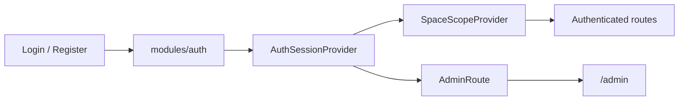

# Identity And Access

## Scope

This subsystem covers authentication, current-user profile access, space scoping, account views, and admin gating.

## Owners

- backend: `modules/auth`, `modules/users`, `modules/spaces`, `modules/admin`, `modules/usage`
- frontend: `features/auth`, `features/account`, `features/spaces`, `features/admin`
- app wiring: `app/guards/`, `app/providers.tsx`, `shared/state/authSession.tsx`, `shared/state/spaceScope.tsx`
- contracts: `packages/contracts/schemas/auth`, `users`, `spaces`, `usage`, `admin`

## Key Routes And Pages

- backend: `/api/v1/auth/*`, `/api/v1/users/*`, `/api/v1/spaces/*`, `/api/v1/usage/me`, `/api/v1/admin/*`
- frontend: `/`, `/login`, `/register`, `/dashboard`, `/spaces`, `/account`, `/admin`

## Important Rules

- backend authorization is authoritative
- space scope must be explicit and shared across workspace reads
- account views consume auth, user, and usage data together
- admin access is gated separately from authenticated access

## Primary Tests

- `apps/api/tests/modules/auth`
- `apps/api/tests/modules/spaces`
- `apps/api/tests/modules/admin`
- `apps/api/tests/modules/usage`
- `apps/web/src/app/tests/guards.test.tsx`
- `apps/web/src/features/dashboard/tests/`
- `apps/web/src/features/auth/tests/`
- `apps/web/src/features/spaces/tests/`
- `apps/web/src/features/account/tests/`
- `apps/web/src/features/admin/tests/`
