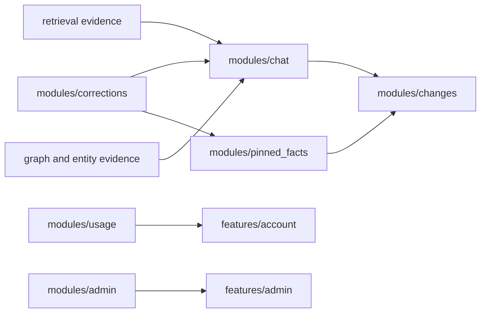

# Interaction And Governance

## Scope

This subsystem covers chat, corrections, pinned facts, changes, usage reporting, and admin oversight.

## Owners

- backend: `modules/chat`, `modules/corrections`, `modules/pinned_facts`, `modules/changes`, `modules/usage`, `modules/admin`
- frontend: `features/chat`, `features/pinned-facts`, `features/changes`, `features/account`, `features/admin`
- contracts: `packages/contracts/schemas/chat`, `corrections`, `pinned_facts`, `changes`, `usage`, `admin`

## Key Routes And Pages

- backend: `/api/v1/chat/*`, `/api/v1/corrections/*`, `/api/v1/pinned-facts/*`, `/api/v1/changes/*`, `/api/v1/usage/me`, `/api/v1/admin/*`
- frontend: `/chat`, `/chat/:sessionId`, `/pinned-facts`, `/pinned-facts/create`, `/pinned-facts/:factId`, `/changes`, `/account`, `/admin`

## Important Rules

- chat should remain evidence-backed and citation-bearing
- correction submission is part of the chat-owned frontend experience
- pinned facts expose current-state summaries without erasing history
- changes provide user-visible history for important state transitions
- admin and usage flows depend on shared instance-policy logic

## Primary Tests

- `apps/api/tests/modules/chat`
- `apps/api/tests/modules/corrections`
- `apps/api/tests/modules/pinned_facts`
- `apps/api/tests/modules/changes`
- `apps/api/tests/modules/usage`
- `apps/api/tests/modules/admin`
- `apps/web/src/features/chat/tests/`
- `apps/web/src/features/pinned-facts/tests/`
- `apps/web/src/features/changes/tests/`
- `apps/web/src/features/account/tests/`
- `apps/web/src/features/admin/tests/`
