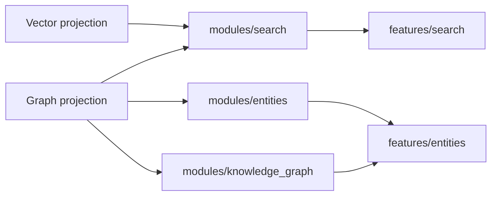

# Retrieval And Knowledge

## Scope

This subsystem covers search, entity views, knowledge graph reads, and the shared evidence layer they depend on.

## Owners

- backend: `modules/search`, `modules/entities`, `modules/knowledge_graph`
- frontend: `features/search`, `features/entities`
- contracts: `packages/contracts/schemas/search`, `entities`, `knowledge_graph`

## Key Routes And Pages

- backend: `/api/v1/search`, `/api/v1/entities/*`, `/api/v1/knowledge-graph/*`
- frontend: `/search`, `/entities`, `/entities/:entityId`

## Important Rules

- scope boundaries must apply before ranking and presentation
- graph and vector evidence can differ, but identifiers and provenance should still line up
- entity views and graph reads should stay evidence-oriented rather than inventing independent truth

## Primary Tests

- `apps/api/tests/modules/search`
- `apps/api/tests/modules/entities`
- `apps/api/tests/modules/knowledge_graph`
- `apps/web/src/features/search/tests/`
- `apps/web/src/features/entities/tests/`
