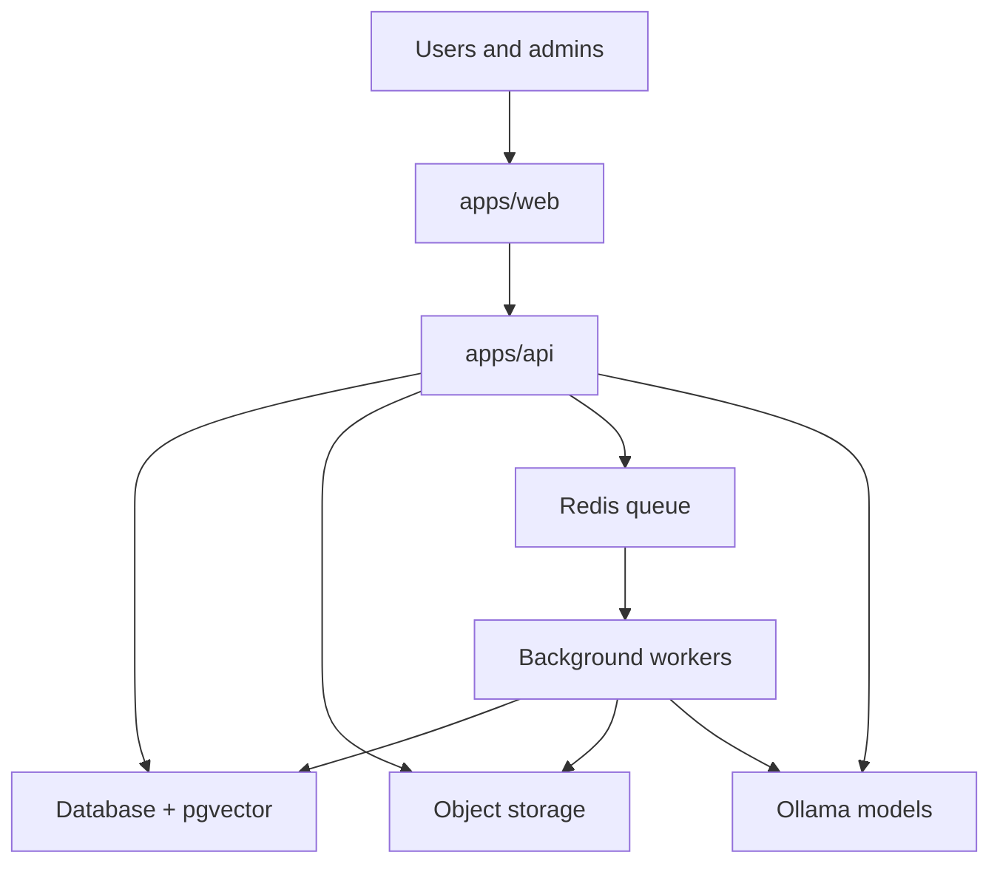
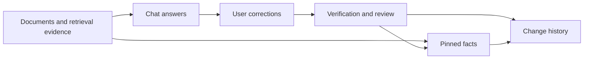

# Operating Model And Risk

## Purpose

Explain how the current self-hosted system operates and where leadership should pay attention to reliability, security, and governance boundaries.

## Operating Model

Ragdoll runs as a modular monolith with a browser app, a backend API, and background workers. The backend is responsible for policy, health checks, API composition, and worker coordination. Supporting services provide storage, queueing, and local model access.

## Reliability Boundaries

- document processing depends on queue, storage, database, and model reachability
- readiness reporting is part of the operating surface, not just developer tooling
- partial failures should remain visible through document and runtime status rather than being hidden

## Security And Governance Boundaries

- backend auth and policy checks are authoritative
- spaces define the main user-facing data boundary
- corrections, pinned facts, and change history provide human review and auditability
- admin surfaces expose operational visibility without bypassing policy layers

## Leadership Risk Areas

- dependency instability can directly affect search, chat, and ingestion quality
- poor correction handling would undermine trust in current-state outputs
- expanding feature surface without aligned documentation would increase onboarding and operational risk

## Human-In-The-Loop Controls

Corrections, pinned facts, and changes form the main governance loop for keeping user-visible answers aligned with trusted evidence.
