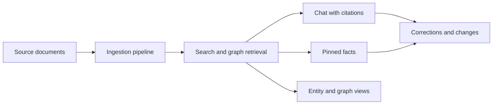

# System Brief

## Purpose

Provide an internal executive summary of what Ragdoll does, how it is structured, and where the major capability boundaries sit.

## What The System Does

Ragdoll is a self-hosted knowledge workspace that turns uploaded documents into evidence-backed search, chat, entity exploration, and current-state summaries. It combines document ingestion, retrieval, graph exploration, and human review loops so teams can ask questions, inspect provenance, and maintain trusted facts over time.

## Core Capability Areas

- identity and space scoping
- document library and upload processing
- search, entities, and knowledge graph exploration
- chat with citations and correction submission
- pinned facts and change tracking
- admin visibility, usage reporting, and runtime status

## Runtime Shape

- one backend application in `apps/api`
- one frontend application in `apps/web`
- background workers for long-running document and fact-processing tasks
- self-hosted dependencies for relational storage, object storage, queueing, and model access

## High-Level Operating Flow

1. A user authenticates and enters a scoped workspace.
2. Documents are uploaded and processed into retrieval-ready projections.
3. Search, entities, graph exploration, and chat read from that evidence layer.
4. Corrections and pinned facts let users refine or lock current-state interpretations.
5. Admin and status surfaces provide visibility into runtime health and effective operating limits.

## Main Risk Areas

- partial ingestion or dependency outages can leave documents only partly processed
- weak provenance would reduce trust in answers and current-state summaries
- scope leakage across spaces would be a product and governance failure
- chat quality depends on retrieval quality and local model availability
